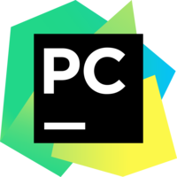
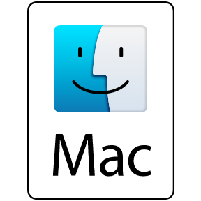

### Hi there 👋

**Liuyf0/Liuyf0** is a ✨ _special_ ✨ repository because its `README.md` (this file) appears on your GitHub profile.

Here are some ideas to get you started:

- 🔭 I’m currently working on ...
- 🌱 I’m currently learning ...
- 👯 I’m looking to collaborate on ...
- 🤔 I’m looking for help with ...
- 💬 Ask me about anything [here](https://github.com/Liuyf0/Liuyf0/issues)
- 📫 How to reach me: ...
- 😄 Pronouns: ...
- ⚡ Fun fact: ...
- ❤️ I love ... 

<!--

-->

|  |  |
| ------------- | ------------- |

 &nbsp;&nbsp;&nbsp;&nbsp;
 
**Languages and Frameworks**

<code></code>
<code></code>
<code></code>
<code></code>
<code></code>
<code></code>
<code></code>
<code></code>
<code></code>
<code></code>
<code></code>

**Tools and Environments**

<code></code>
<code></code>
<code></code>
<code></code>
<code></code>
<code></code>
<code></code>
<code></code>
<code></code>
