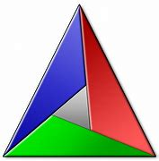
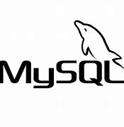
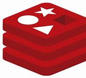
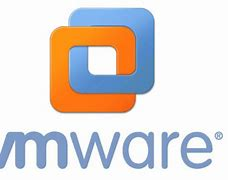

<!-- ### Hi there 👋

**NAIUI/NAIUI** is a ✨ _special_ ✨ repository because its `README.md` (this file) appears on your GitHub profile.

Here are some ideas to get you started:

- 🔭 I’m currently working on ...
- 🌱 I’m currently learning ...
- 👯 I’m looking to collaborate on ...
- 🤔 I’m looking for help with ...
- 💬 Ask me about anything [here](https://github.com/NAIUI/NAIUI/issues)
- 📫 How to reach me: ...
- 😄 Pronouns: ...
- ⚡ Fun fact: ...
- ❤️ I love ...  -->
<h1 align="center">
  Hey, I'm NAIUI!
</h1>

    <b><a href="https://github.com/torvalds/linux">Linux</a></b>
    •
    <b><a href="https://github.com/redis/redis">redis</a></b>
    •    
    <b><a href="https://github.com/grpc/grpc)">gRPC</a></b>
    •
    <b><a href="https://NAIUI.github.io/">Blog</a></b>
    <!-- •<b><a href="lingh9@foxmail.com">Email</a></b> -->
    <!-- •<b><a href="https://www.paypal.me/younger">Sponsor</a></b> -->

    
    
    
    

    
    
    
    

<!--

  
<!--    -->
<!--     -->

<!--

-->

|  |  |
| ------------- | ------------- |

 &nbsp;&nbsp;&nbsp;&nbsp;
 
**Languages and Frameworks**

<code></code>
<code></code>
<code></code>
<code></code>
<code></code>
<code></code>
<code></code>
<code></code>
<code></code>
<code></code>

**Tools and Environments**

<code></code>
<code></code>
<code></code>
<code></code>
<code></code>
<code></code>
<code></code>
<code></code>
<code></code>
<code></code>

## 🏆 Github Profile Trophy

